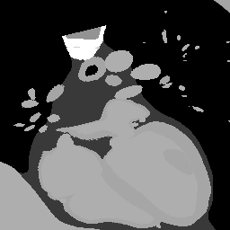
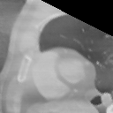
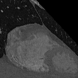
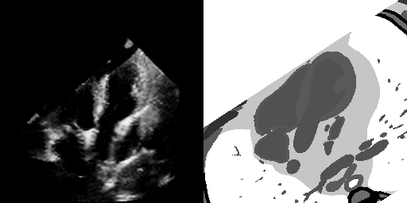

# AutomaticUSnavigation

Investigating automatic navigation towards standard US views integrating MARL with the virtual US environment developed in [CT2US simulation](https://github.com/CesareMagnetti/CT2UStransfer). We will start by investigating navigation in the XCAT phantom volumes, then integrate our cycleGAN model to the pipeline to perform navigation in US domain. We also test navigation on clinical CT scans. Please see the[arxiv preprint](https://arxiv.org/pdf/2111.03485.pdf).

## example of agents navigating in a test XCAT phantom volume (not seen at train time)

The agent is in control of moving 3 points in a 3D volume, which will sample the corresponding plane. We aim to model the agent to learn to move towards 4-chamber views. We define such views as the plane passing through the centroids of the Left Ventricle, Right Ventricle and Right Atrium (XCAT volumes come with semantic segmentations). We reward the agent when it moves towards this goal plane, and when the number of pixels of tissues of interest present in the current plane increase (see rewards/rewards.py fro more details). Furthermore, we add some good-behaviour inducing reards: we maximize the area of the triangle spanned by the agents and we penalize the agents for moving outside of the volumes boundaries. The former encourages smooth transitions (if the agents are clustered close together we would get abrupt transitions) the latter makes sure that the agents stay within the boundaries of the environment. The following animation shows agents navigating towards a 4-Chamber view on a test XCAT volume, agents are initialized randomly within the volume.

<div align="center">
    <br>
	Fig 1: Our best agent acting greedily for 250 steps after random initialization. Our full agent consists of 3 sub-agents, each controlling the movement of 1 	     point in a 3D space. As each agent moves around the 3 points will sample a particular view of the CT volume.<br>
</div>

## example of agents navigating in clinical CTs
We than upgrade our pipeline generating realistic fake CT volumes using Neural Style Transfer on our XCAT volumes. We will generate volumes which aim to resemble CT texture while retaining XCAT content. We train the agents in the same manner on this new simulated environment and we test practicality both on unseen fake CT volumes and on clinical volumes from LIDC-IDRI dataset. 

<div align="center">
    
    <br>
	Fig 2: Left) Our best agent acting greedily on a test fake CT volume for 125 steps after random initialization. Right) same agents tested on clinical CT data.<br>
</div>

## example of agents navigating on synthetic US
We couple our navigation framework with a CycleGAN that transforms XCAT slices into US images on the fly. Our CycleGAN model is not perfect yet and we are limited to contrain the agent within +/- 20 pixels from the goal plane. Note that we invert intensities of the XCAT images to facilitate the translation process.

<div align="center">
    <br>
	Fig 1: Our best agent acting greedily for 50 steps after initialization within +/- 20 pixels from the goal plane. The XCAT volume is used a proxy for navigation in US domain. <br>
</div>

## usage

1. clone the repo and install dependencies

```bash
git clone git@github.com:CesareMagnetti/AutomaticUSnavigation.git
cd AutomaticUSnavigation
python3 -m venv env
source env/bin/activate
pip install -r requirements
```

2. if you don't want to integrate the script with weights and biases run scripts with the additional ```--wandb disabled``` flag.

3. train our best agents on 15 XCAT volumes (you must generate these yourself). It will save results to ```./results/``` and checkpoints to ```./checkpoints/```. Then test the agent 100 times on all available volumes (in our case 20) and generate some test trajectories to visualize results.

```bash
python train.py --name 15Volume_both_terminateOscillate_Recurrent --dataroot [path/to/XCAT/volumes] --volume_ids samp0,samp1,samp2,samp3,samp4,samp5,samp6,samp7,samp8,samp9,samp10,samp11,samp12,samp13,samp14 --anatomyRewardWeight 1 --planeDistanceRewardWeight 1 --incrementalAnatomyReward --termination oscillate --exploring_steps 0 --recurrent --batch_size 8 --update_every 15

python test.py --name 15Volume_both_terminateOscillate_Recurrent --dataroot [path/to/XCAT/volumes] --volume_ids samp0,samp1,samp2,samp3,samp4,samp5,samp6,samp7,samp8,samp9,samp10,samp11,samp12,samp13,samp14,
samp15,samp16,samp17,samp18,samp19 --n_runs 2000 --load latest --fname quantitative_metrics

python test_trajectory.py --name 15Volume_both_terminateOscillate_Recurrent --dataroot [path/to/XCAT/volumes] --volume_ids samp15,samp16,samp17,samp18,samp19 --n_steps 250 --load latest
```

3. train our best agent on the fake CT volumes (we can then test on real CT data).

```bash
python make_XCAT_volumes_realistic.py --dataroot [path/to/XCAT/volumes] --saveroot [path/to/save/fakeCT/volumes] --volume_ids samp0,samp1,samp2,samp3,samp4,samp5,samp6,samp7,samp8,samp9,samp10,samp11,samp12,samp13,samp14,
samp15,samp16,samp17,samp18,samp19 --style_imgs [path/to/style/realCT/images] --window 3

python train.py --name 15Volume_CT_both_terminateOscillate_Recurrent_smoothedVolumes_lessSteps --volume_ids samp0,samp1,samp2,samp3,samp4,samp5,samp6,samp7,samp8,samp9,samp10,samp11,samp12,samp13,samp14 --anatomyRewardWeight 1 --planeDistanceRewardWeight 1 --incrementalAnatomyReward --termination oscillate --exploring_steps 0 --recurrent --batch_size 8 --update_every 15 --dataroot [path/to/fakeCT/volumes] --load_size 128 --no_preprocess --n_steps_per_episode 125 --buffer_size 25000 --randomize_intensities

python test_trajectory.py --name 15Volume_CT_both_terminateOscillate_Recurrent_smoothedVolumes_lessSteps --dataroot [path-to/realCT/volumes] --volume_ids 128_LIDC-IDRI-0101,128_LIDC-IDRI-0102 --load latest --n_steps 125 --no_preprocess --realCT
```

4. train our best agent on fake US environment
```bash
python train.py --name 15Volumes_easyObjective20_CT2USbestModel_bestRL --easy_objective --n_steps_per_episode 50 --buffer_size 10000 --volume_ids samp0,samp1,samp2,samp3,samp4,samp5,samp6,samp7,samp8,samp9,samp10,samp11,samp12,samp13,samp14 --dataroot [path/to/XCAT/volumes(must rotate)] --anatomyRewardWeight 1 --planeDistanceRewardWeight 1 --incrementalAnatomyReward --termination oscillate --exploring_steps 0 --batch_size 8 --update_every 12 --recurrent --CT2US --ct2us_model_name bestCT2US

python test_trajectory.py --name 15Volumes_easyObjective20_CT2USbestModel_bestRL --dataroot [path/to/XCAT/volumes(must rotate)] --volume_ids samp15,samp16,samp17,samp18,samp19 --easy_objective --n_steps 50 --CT2US --ct2us_model_name bestCT2US --load latest
```


## Acknowledgements
Work done with the help of [Hadrien Reynaud](https://github.com/HReynaud). Our CT2US models are built upon the [CT2US simulation](https://github.com/CesareMagnetti/CT2UStransfer) repo, which itself is heavily based on [CycleGAN-and-pix2pix](https://github.com/junyanz/pytorch-CycleGAN-and-pix2pix) and [CUT](https://github.com/taesungp/contrastive-unpaired-translation) repos.


