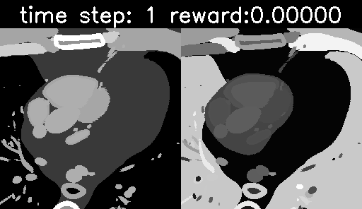

# AutomaticUSnavigation

Investigating automatic navigation towards standard US views integrating RL/decision transformer with the virtual US environment developed in [CT2US simulation](https://github.com/CesareMagnetti/CT2UStransfer). We will start by investigating navigation in the CT volume, then integrate our cycleGAN model to the pipeline to perform navigation in US domain.

## example untrained agent exploiting it's value function

The agent is in control of moving 3 points in a 3D volume, which will select the corresponding CT plane that is sampled. We aim to model the agent to learn to move towards planes which maximize the visibility of a certain anatomical structure (i.e. the left ventricle) and we reward him according to the ratio of pixels in the 2D view that belong to the goal anatomical structure. The following animation shows an untrained agent navigating throughout the CT volume.

<div align="center">
    <br>
	Fig 2: An untrained agent acting greedily. Our full agent consists of 3 sub-agents, each controlling the movement of 1 point in a 3D space. As each agent 	  moves around the 3 points will sample a particular view of the CT volume.<br>
</div>

## usage

1. clone the repo and install dependencies

```bash
git clone git@github.com:CesareMagnetti/AutomaticUSnavigation.git
cd AutomaticUSnavigation
python3 -m venv env
source env/bin/activate
pip install -r requirements
```
2. run an untrained agent on our default volume. It will save a 250 steps navigation to ```./results```.

```bash
python main.py -r /vol/biomedic3/hjr119/XCAT/generation/  --name untrained_agent
```

3. train a DQN agent to navigate towards a 2D view that maximizes the number of pixels in the Left Ventricle (or any other anatomical structure). It will then save 250 steps of the learned greedy trajectory.

```bash
python main.py -r /vol/biomedic3/hjr119/XCAT/generation/ --train --name experiment_name
```

NOTE: this functionality does not work yet.

## Acknowledgements
Work done with the help of [Hadrien Reynaud](https://github.com/HReynaud). Our CT2US models are built upon the [CT2US simulation](https://github.com/CesareMagnetti/CT2UStransfer) repo, which itself is heavily based on [CycleGAN-and-pix2pix](https://github.com/junyanz/pytorch-CycleGAN-and-pix2pix) and [CUT](https://github.com/taesungp/contrastive-unpaired-translation) repos.


