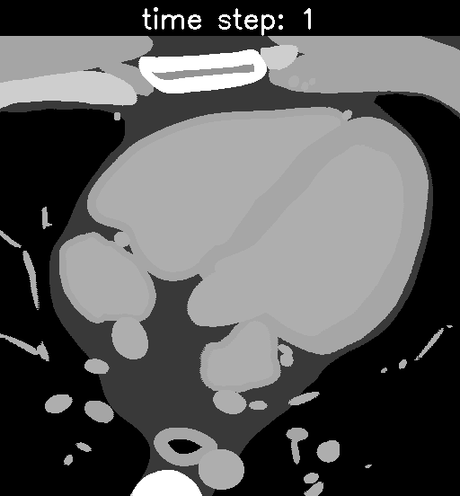

# AutomaticUSnavigation

Investigating automatic navigation towards standard US views integrating RL/decision transformer with the virtual US environment developed in [CT2US simulation](https://github.com/CesareMagnetti/CT2UStransfer).

## example random walk trajectory
for now we have implemented the baseline plane sampling for the agent to move around the CT volume. The agent is in control of moving 3 points in a 3D volume, which will select the corresponding CT plane that is sampled. We model the agent to learn to move towards planes which maximize the visibility of a certain anatomical structure (i.e. the left ventricle) and we reward him according to the number of pixels in the 2D view that belong to the goal anatomical structure. Below is an example of a random walk through the CT volume (left) and the corresponding segmented slice (right). The reward at this time step will simply be the normalized count of pixels belonging to the left ventricle. The agent is incentivized to navigate towards a slice that mazimizes the visibility of the left ventricle.

<div align="center">
    <br>
	Fig 1: A random walk throug the CT volume with the corresponding (not normalized) reward. On the left we have the sampled CT planes by an agent following a 	    random walk, on the right we have the corresponding segmentation. The reward corresponds to the number of pixels in the 2D slice that belong to the left     	 ventricle.<br>
</div>

## example untrained agent exploiting it's value function

The following pictures shows an untrained agent navigating throughout the CT volume.

<div align="center">
    <br>
	Fig 2: An untrained agent acting greedily. Our full agent consists of 3 sub-agents, each controlling the movement of 1 point in a 3D space. As each agent 	  moves around the 3 points will sample a particular view of the CT volume.<br>
</div>

## usage

1. clone the repo and install dependencies

```bash
git clone git@github.com:CesareMagnetti/AutomaticUSnavigation.git
cd AutomaticUSnavigation
python3 -m venv env
source env/bin/activate
pip install -r requirements
```
2. run an untrained agent on our default volume. It will save a 250 steps navigation to ```./results```.

```bash
python main.py -r /vol/biomedic3/hjr119/XCAT/generation/
```

3. train a DQN agent to navigate towards a 2D view that maximizes the number of pixels in the Left Ventricle (or any other anatomical structure). It will then save 250 steps of the learned greedy trajectory.

```bash
python main.py -r /vol/biomedic3/hjr119/XCAT/generation/ --train
```

NOTE: this functionality does not work yet.

## Acknowledgements
Work done with the help of [Hadrien Reynaud](https://github.com/HReynaud). Our CT2US models are built upon the [CT2US simulation](https://github.com/CesareMagnetti/CT2UStransfer) repo, which itself is heavily based on [CycleGAN-and-pix2pix](https://github.com/junyanz/pytorch-CycleGAN-and-pix2pix) and [CUT](https://github.com/taesungp/contrastive-unpaired-translation) repos.


