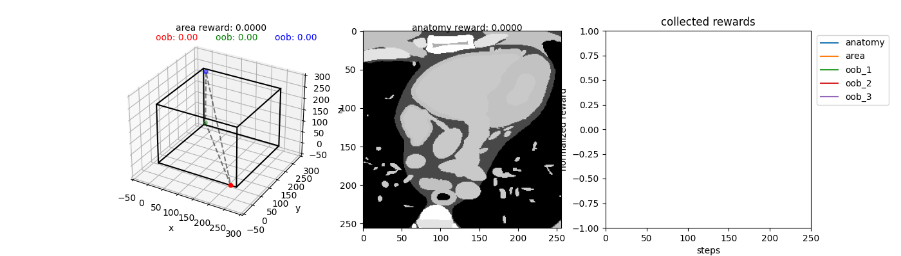

# AutomaticUSnavigation

Investigating automatic navigation towards standard US views integrating RL/decision transformer with the virtual US environment developed in [CT2US simulation](https://github.com/CesareMagnetti/CT2UStransfer). We will start by investigating navigation in the CT volume, then integrate our cycleGAN model to the pipeline to perform navigation in US domain.

## example untrained agent exploiting it's value function

The agent is in control of moving 3 points in a 3D volume, which will select the corresponding CT plane that is sampled. We aim to model the agent to learn to move towards planes which maximize the visibility of a certain anatomical structure (i.e. the left ventricle) and we reward him according to the ratio of pixels in the 2D view that belong to the goal anatomical structure. Furthermore, we add a small penalty for each time-step to encourage the agent to move towards planes of interest and we add another penalty if the agent moves towards the edges of the volume, which do not contain any meaningful information. This is implemented by rewarding the agent proportionally to the area of the triangle spanned by the 3 points (encouraging points to be far apart, hence not all clustered at an edge of the volume). The following animation shows an untrained agent navigating throughout the CT volume.

<div align="center">
    <br>
	Fig 2: An untrained agent acting greedily. Our full agent consists of 3 sub-agents, each controlling the movement of 1 point in a 3D space. As each agent 	  moves around the 3 points will sample a particular view of the CT volume.<br>
</div>

<div align="center">
    <br>
	Fig 2: Our default agent acting greedily for 250 steps after random initialization. Our full agent consists of 3 sub-agents, each controlling the movement of 1 point in a 3D space. As each agent moves around the 3 points will sample a particular view of the CT volume.<br>
</div>

## usage

1. clone the repo and install dependencies

```bash
git clone git@github.com:CesareMagnetti/AutomaticUSnavigation.git
cd AutomaticUSnavigation
python3 -m venv env
source env/bin/activate
pip install -r requirements
```

2. if you don't want to integrate the script with weights and biases run scripts with the additional ```--wandb disabled``` flag.

3. run our default untrained agent on the default volume. It will save a 250 steps animation to ```./results/untrained_agent/test/sample_0.gif```.

```bash
python test_visual.py --name untrained_agent --n_runs 1 --n_steps 250
```

3. train our default agent on the default volume to navigate towards a 2D view that maximizes the number of pixels in the Left Ventricle (or any other anatomical structure). In this case we are training for 2000 episodes of 250 steps each (takes approximately 3 hours on a GTX TITANX NVIDIA 12GB).

```bash
python train.py -r --name default_agent --n_episodes 2000 --n_steps_per_episode 250
```


## Acknowledgements
Work done with the help of [Hadrien Reynaud](https://github.com/HReynaud). Our CT2US models are built upon the [CT2US simulation](https://github.com/CesareMagnetti/CT2UStransfer) repo, which itself is heavily based on [CycleGAN-and-pix2pix](https://github.com/junyanz/pytorch-CycleGAN-and-pix2pix) and [CUT](https://github.com/taesungp/contrastive-unpaired-translation) repos.


