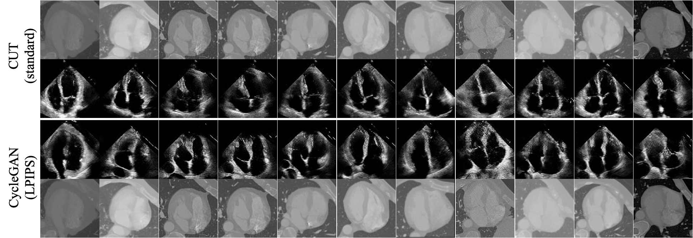
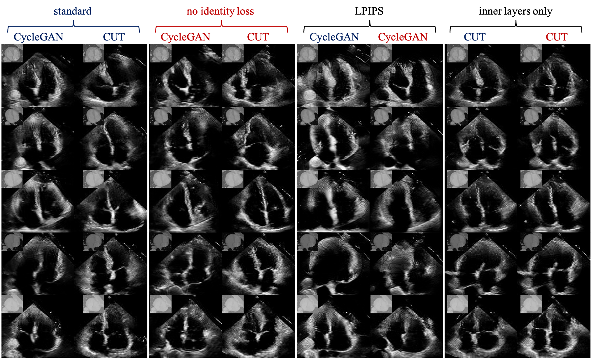
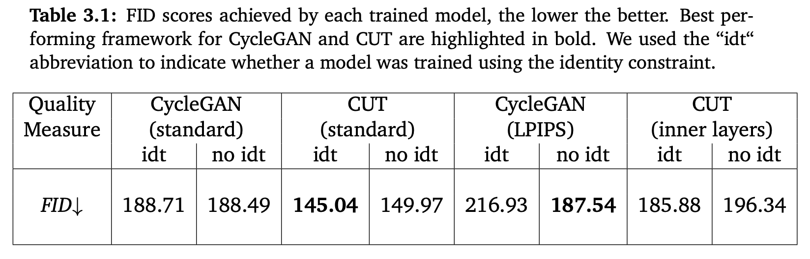

# Experiments for CycleGAN and Constrastive-Unpaired-Transaltion (CUT) to simulate US images from CT content

<div align="center">
    <br>
	Fig 1: Diagram showing results of the two top performing architectures, each column represents a a different randomly sampled CT slice from the test set. 	  The second and third rows respectively show simulated US for a standard CUT and a CycleGAN with LPIPS cycle-consistency loss and no identity loss. The top 	 and bottom rows represent the same CT content slices for ease of comparison.
</div><br><br>

# Dependencies

before running any experiment make sure you have all the dependencies needed.

```bash
git clone git@gitlab.com:mscthesis1/backgroundexperiments.git
python3 -m venv env
source env/bin/activate
pip install -r requirements.txt
```
# Experiments
Keeping the default models and guidelines from the original papers we carried out the following experiments:

1. We kept the suggested values from the original CycleGAN and CUT papers and trained everything out of the box.
2. We removed the identity loss constraints from both architectures. The authors used these constraints arguing that the model should learn to selectively translate areas of interest and leave the background relatively unchanged. Forcing the model to not modify a target image (an image that does not need to be translated to the target domain) inderictly induces it to learn to not modify background regions. For the case of CT2US we do not have background regions, we want to translate every pixel of the CT slice to the corresponding US image. For this reason, we investigate the outcomes of not applying this loss to the optimisation process. 
3. We investigate the effects of using a perceptual loss for cycle-consistency. Theoretically, a perceptual loss should lead better reconstructions, improving cycle stability of CycleGAN. In particular, we use the LPIPS pretrained loss than has been shown to yield state of the art results in assessing perceptual similarity.
4. The patch-wise loss in CUT aims to maximize mutual-information between image patches. When both the source and target images are natural looking, this concept works great, however, the amount of information contained in CT and US images is drastically different due to speckle. For this reason we hypothesize that mutual information between US and CT patches will not be as meaningful. To verify this hypothesis, we remove the input and output layers from the patch-wise loss and only consider inner layers.
# Results

Here are some examples of what we were able to achieve with these preliminary experiments, they will act as a baseline for future research.

<div align="center">
    <br>
	Fig 2: Diagram showing results of all described experiments, each column represents a different model and each row a different randomly sampled CT slice 	 from the test set. We color-coded experiment 2 outcomes such that models highlighted in blue where trained using the identity constraint, while models 		highlighted in red are not using this constraint. Each column block respectively reports results for experiments 1,2,3 and 4. The corresponding CT content 	   is embedded in the top left corner of each generated US.
</div><br><br>

<div align="center">
    <br>
</div><br><br>

From the above results we came to the conclusion that a CycleGAN without the identity constraint and using LPIPS as a cycle-consistency loss gives the most accurate results. A standard CUT was also found to yield good results, however, it struggles to retain the right CT content. Fig. 1 emphasizes this observation, as we can see that the generate US are much more aligned using the CycleGAN.

# Usage

To replicate all the experiments run:

```bash
bash launch_preliminary_experiments.sh <path/to/data> <path/to/checkpoints>
bash test_preliminary_experiments.sh <path/to/data> <path/to/checkpoints> <path/to/results>
```

To only train the best model run:

```bash
python CycleGAN/train.py --dataroot <path/to/data> --checkpoints_dir <path/to/checkpoints> --name CycleGAN_LPIPS_noIdtLoss --model cycle_gan --input_nc 1 --output_nc 1 --batch_size 2 --cycle_loss LPIPS --save_epoch_freq 10 --lambda_identity 0
python CycleGAN/test.py --dataroot <path/to/data> --checkpoints_dir <path/to/checkpoints> --results_dir <path/to/results> --name CycleGAN_LPIPS_noIdtLoss --model cycle_gan --input_nc 1 --output_nc 1
bash rearrange_files_cycle_gan.sh <path/to/results>/CycleGAN_LPIPS_noIdtLoss/test_latest/images/
python -m pytorch_fid <path/to/results>/CycleGAN_LPIPS_noIdtLoss/test_latest/images/real_B <path/to/results>/CycleGAN_LPIPS_noIdtLoss/test_latest/images/fake_B
```

# Acknowledgments
The code is heavily based on [CycleGAN-and-pix2pix](https://github.com/junyanz/pytorch-CycleGAN-and-pix2pix) and [CUT](https://github.com/taesungp/contrastive-unpaired-translation) with only slight modifications for the perceptual cycle-consistency loss. LPIPS implementation taken from [PerceptualSimilarity](https://github.com/richzhang/PerceptualSimilarity) and FID scores where calculated using [pytorch-fid](https://github.com/mseitzer/pytorch-fid).

# Logs

-there is a bug in CUT repo for grayscale -> grayscale translation. In data/unaligned_dataset.py line 67 replace: ```transform = get_transform(modified_opt)``` with ```transform = get_transform(modified_opt, grayscale = opt.input_nc == 1)```.
